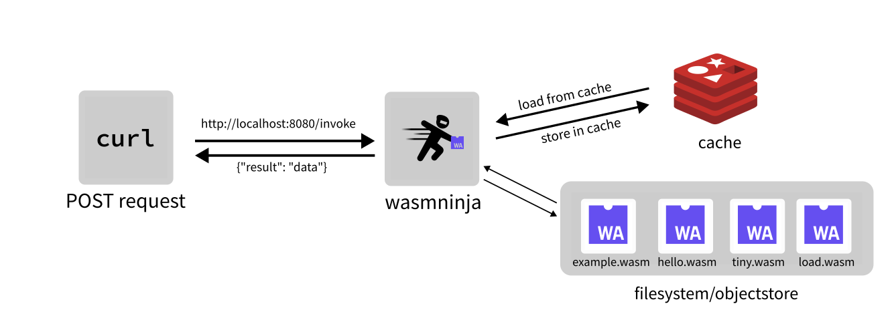

# wasmninja

wasmninja is a micro serverless platform which runs WebAssembly modules as serverless functions.

- **WASM-powered**: Write modules in **any language!** (that [compiles to WebAssembly](https://github.com/appcypher/awesome-wasm-langs))
- **Flexible storage**: Store modules in the filesystem or an object store like Minio.
- **Cached modules:** Automatic caching mechanism for frequently-accessed modules.

### Loading Modules

`wasmninja` supports loading modules from the filesystem (`fs`) or from an object store (`objectstore`) like Minio.

`wasmninja` preloads all modules present in the configured storage (`fs`/`objectstore`). Users can add new modules in the configured storage location.

## Architecture



## Getting started

`wasmninja` requires [Redis](https://redis.io/) for caching modules. Please run a Redis server (`redis-server`) before getting started.

#### Releases

The easiest way to get started is to install `wasmninja` by downloading the releases.

#### Docker

Download the [Dockerfile](./Dockerfile) and build the image:

```
docker build -t wasmninja .
```

#### Docker Compose

Download the [docker-compose.yml](./docker-compose.yml) to spin up the server and object store (Minio):

```
docker-compose --file=docker-compose.yml up
```

## Example

In this example, we'll build a tiny WebAssembly module using Go.

`wasmninja` uses environment variables for storing user-provided data as it provides modules with the freedom to define their own logic for processing the user-provided data, allowing for greater customization and adaptability to different use cases.

Data sent to the module is stored in the `WASMNINJA_DATA` environment variable, which can be loaded by the module. In this example, we'll print the data which was sent by the user.

Here is the code for the module:

```go
// main.go
package main

import (
    "fmt"
    "os"
)

func main() {
        fmt.Println("Go WebAssembly module")
        data := os.Getenv("WASMNINJA_DATA")
        fmt.Printf("data received from wasmninja: %s\n", data)
}
```

In order to compile it to WebAssembly (WASI), we'll be using [TinyGo](https://tinygo.org/):

```
tinygo build -o ./wasm_modules/example.wasm -target=wasi main.go
```

Once built, we need to load the built `example.wasm` in our module loader. For this example, we'll be using `fs` (filesystem) as the module loader.

Let's prepare the configuration file:

```yaml
# config.yaml
cache:
  address: localhost:6379
  password: ""
  db: 0

loader:
  module_loader: fs
  module_directory: "./wasm_modules"
```

Before running the server, we need to run the Redis server for caching modules:

```
redis-server
```

Start the server:

```
./wasmninja
2023/05/16 22:23:28 Starting server on localhost:8080....
```

Send a request to the `/invoke` route:

```sh
curl -s -X POST \
  -H "Content-Type: application/json" \
  -d '{"module": "example", "data": "additional data"}' \
  http://localhost:8080/invoke | jq
```

The response from `wasmninja` is a JSON with a `result` field, which contains the module's output:

```json
{
  "result": "Go WebAssembly module\ndata received from wasmninja: additional data\n"
}
```

The module received the additional data passed to `wasmninja` as expected.

## Configuration

### Server Configuration

The server configuration includes the host and port settings.

```yaml
server:
  host: localhost
  port: 8080
```

- `host` (string, optional): The hostname or IP address on which the server listens. Defaults to `localhost`.
- `port` (integer, optional): The port number on which the server listens. Defaults to `8080`.

### Cache Configuration

The cache configuration specifies the address, password, and database for the cache server (Redis).

```yaml
cache:
  address: redis://localhost:6379
  password: ""
  db: 0
```

- `address` (string, required): The address of the cache server.
- `password` (string, optional): The password for accessing the cache server. Leave it empty if no password is required.
- `db` (integer, optional): The database number to use in the cache server. Defaults to `0`.

### Loader Configuration

The loader configuration determines how the modules are loaded and where they are located.

```yaml
loader:
  minio_config:
    endpoint: http://localhost:9000
    access_key: minioaccesskey
    secret_key: miniosecretkey
    bucket_name: wasmninja
  module_loader: objectstore
  module_directory: wasm_modules
```

- `minio_config` (object, optional): Configuration for connecting to a Minio object store if the module loader is set to `objectstore`.
  - `endpoint` (string, required): The endpoint URL of the Minio server.
  - `access_key` (string, required): The access key for authenticating with the Minio server.
  - `secret_key` (string, required): The secret key for authenticating with the Minio server.
  - `bucket_name` (string, required): The name of the bucket in the Minio server where the modules are stored.
- `module_loader` (string, required): The type of module loader to use. Valid options are `objectstore` or `fs`.
- `module_directory` (string, optional): The directory path where the modules are stored if the module loader is set to `fs`.

### Example Configuration

Here is a sample configuration for `wasmninja` which uses the objectstore for loading modules:

```yaml
server:
  host: localhost
  port: 8080

cache:
  address: redis://localhost:6379
  password: ""
  db: 0

loader:
  minio_config:
    endpoint: http://localhost:9000
    access_key: minioaccesskey
    secret_key: miniosecretkey
    bucket_name: wasmninja
  module_loader: objectstore
  module_directory: wasm_modules
```

## API Documentation

### Invoke Module

Invoke a WebAssembly module.

```
POST /invoke
```

**Request Body**

```json
{
  "module": "<module_name>",
  "data": "<data>"
}
```

- `module` (string): The name of the WebAssembly module to invoke.
- `data` (string): The data to pass to the module.

**Response**

```json
{
  "result": "<output>"
}
```

- `result` (string): Module's output.

### Health Check

Check the health status of the server.

```
GET /health
```

**Response**

- Status Code: 200
- Body: "OK"


## License

`wasmninja` is licensed under the [MIT license](LICENSE).
