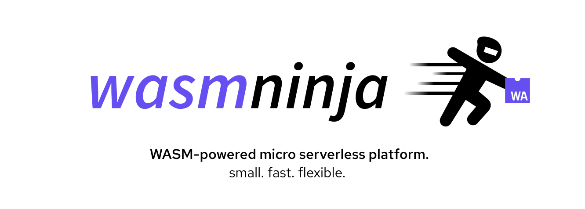

# wasmninja

wasmninja is a micro serverless platform which runs WebAssembly modules as serverless functions.

- **WASM-powered**: Write modules in **any language!** (that [compiles to WebAssembly](https://github.com/appcypher/awesome-wasm-langs))
- **Flexible storage**: Store modules in the filesystem or an object store like Minio.
- **Cached modules:** Automatic caching mechanism for frequently-accessed modules.

## Getting started

#### Releases

The easiest way to get started is to install `wasmninja` by downloading the releases.

#### Docker

Download the [Dockerfile](./Dockerfile) and build the image:

```
docker build -t wasmninja .
```

#### Docker Compose

Download the [docker-compose.yml](./docker-compose.yml) to spin up the :

```
docker-compose --file=docker-compose.yml up
```

## Example

In this example, we'll build a tiny WebAssembly module which `wasmninja` can load and run.

Here is the code for the module:

```go
// main.go
package main

import (
    "fmt"
    "os"
)

func main() {
        fmt.Println("Go WebAssembly module")
        data := os.Getenv("WASMNINJA_DATA")
        fmt.Printf("data received from wasmninja: %s\n", data)
}
```

In order to compile it to WebAssembly (WASI), we'll be using [TinyGo](https://tinygo.org/):

```
tinygo build -o example.wasm -target=wasi main.go
```

Once built, we need to load the built `example.wasm` in our module loader. For this example, we'll be using `fs` (filesystem) as the module loader.

Let's prepare the configuration file:

```yaml
cache:
  address: localhost:6379
  password: ""
  db: 0

loader:
  module_loader: fs
  module_directory: "./wasm_modules"
```

Before running the server, we need to run the Redis server for caching modules:

```
redis-server
```

Start the server:

```
./wasmninja
2023/05/16 22:23:28 Starting server on localhost:8080....
```

Send a request to the `/invoke` route:

```sh
curl -s -X POST \
  -H "Content-Type: application/json" \
  -d '{"module": "example", "data": "additional data"}' \
  http://localhost:8080/invoke | jq
```

The response from `wasmninja` is a JSON with a `result` field, which contains the module's output:

```json
{
  "result": "Go WebAssembly module\ndata received from wasmninja: additional data\n"
}
```

The module received the additional data passed to `wasmninja` as expected.

## License

`wasmninja` is licensed under the [MIT license](LICENSE).
